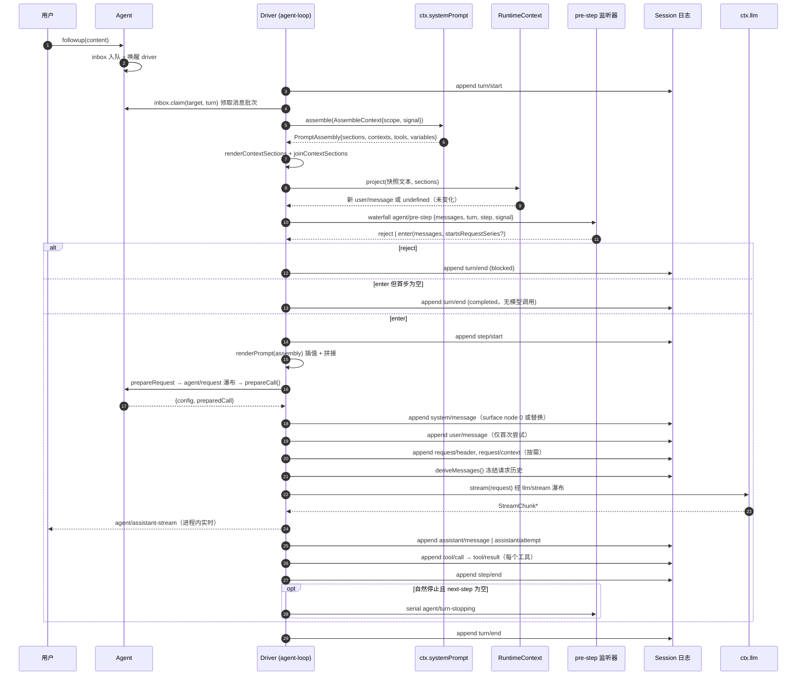
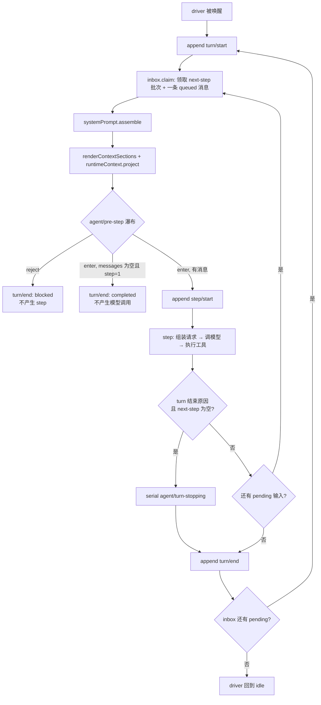
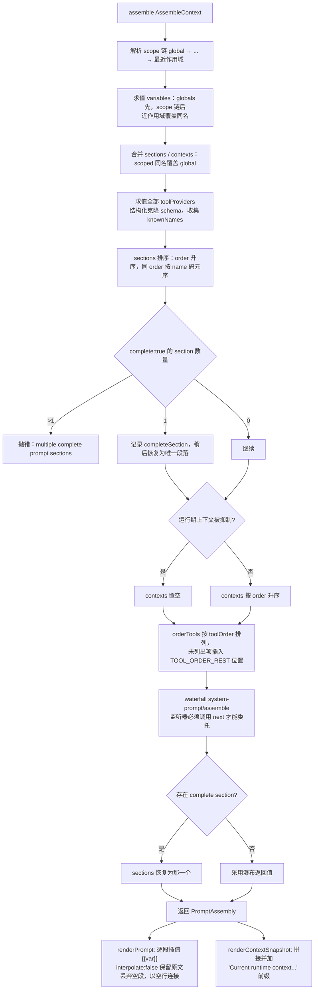
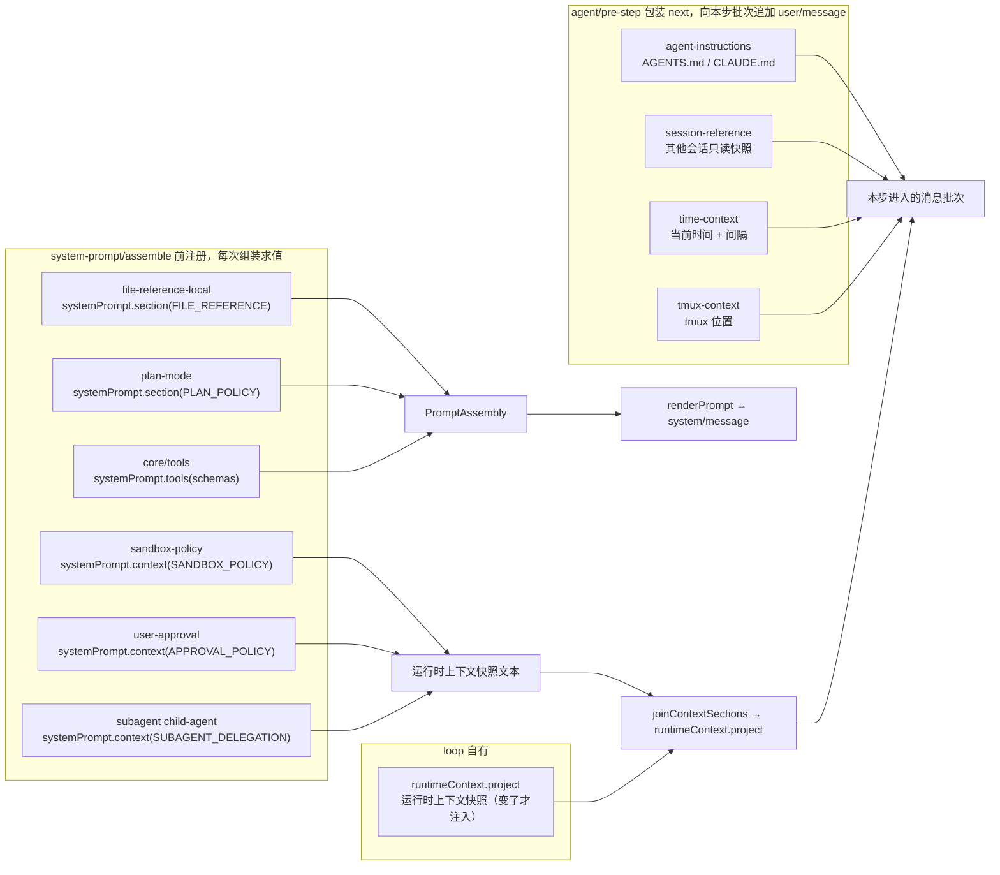
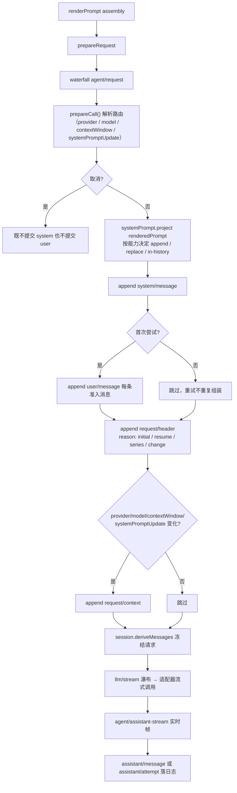
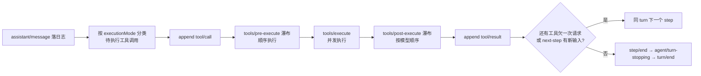
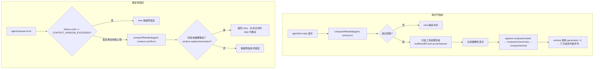

# DeepSeek Harness：用户提问后的内部执行流程

> 目的：把「用户发一条消息」到「模型看到请求」之间，**代码实际执行的顺序**画清楚 —— 提示词注入在哪一步发生、有哪些决策点、谁在什么钩子上贡献内容。
>
> 依据（全部核对过本地代码，不是推测）：
> - 本地 checkout：`D:\gitProject\testCAD\portable\deepseek-harness-main`，版本 `0.1.6-alpha.1`，HEAD = upstream master (`0d1f5000`, 2026-09-15) + 2 个 fork 提交
> - 官方文档：`official/architecture.md#turn-flow`、`official/agent-lifecycle.md`、`official/system-prompt.md`
> - 抓取包：`D:\gitProject\testCAD\portable\dsh-online-docs\`（本站点快照 = `dsh-v0.1.5-rc.2`，比本代码旧约 5 天）
> - 每个流程图末尾给出源码位置，可逐条复核

---

## 0. 一句话总览

```
用户消息 → Agent.inbox → driver 唤醒
        → turn/start
        → pre-step：领取消息
                   ├─ 组装系统提示词（sections + contexts + tools + variables）
                   ├─ 渲染动态运行时上下文快照（变了才注入）
                   └─ agent/pre-step 瀑布：reject | enter(messages)   ← 决策点
        → step/start
        → agent/request → prepareCall（解析路由）
        → system/message（提示词作为 surface 节点）
        → user/message（准入消息首次追加）
        → request/header + request/context
        → deriveMessages() 冻结历史 → llm/stream
        → assistant/message | assistant/attempt
        → tool/call → tools/pre-execute → tools/execute → tools/post-execute → tool/result
        → step/end
        → 欠下一次请求或有新输入 → 同 turn 下一 step；否则 agent/turn-stopping → turn/end
```

关键点：**系统提示词不是请求字段，而是会话日志里的一条 `system/message` surface 节点**；模型历史由 `deriveMessages()` 从日志投影得到。

---

## 1. 总时序图（跨组件）



来源：`packages/core/agent-loop/src/agent.ts`（`preStep` 236-258、`turn` 262-350、`step` 352+）、`packages/core/system-prompt/src/index.ts`。

---

## 2. 主循环决策图（turn / step / pre-step）



决策语义（`packages/core/agent/src/runtime-types.ts:112`）：

| 决策 | 含义 | 后果 |
|---|---|---|
| `{kind:'reject'}` | 拒绝本次准入 | turn 以 `blocked` 结束，**不消耗 step** |
| `{kind:'enter', messages}` | 采纳这批消息进入本步 | 首次 enter 且 `messages` 为空 → turn 以 `completed` 结束（不调模型） |
| `{kind:'enter', messages, startsRequestSeries:true}` | 声明开始新的模型消息序列 | 记录新的 `request/header`（reason=`series`） |

默认实现（无监听器改写时）：`enter(claimed + runtimeContextMessage)`。

---

## 3. 提示词组装流程（`ctx.systemPrompt.assemble`）



要点：
- 段落文本里的 `{{name}}` 在 `renderPrompt` 阶段插值；未注册的变量 / 畸形引用直接抛错（不会静默替换）。
- `complete: true` 的段落让提示词"只剩它"——但为了解析工具与变量，协作瀑布仍然会跑完。
- `suppressRuntimeContext()` 只清空动态 context 贡献，**不改变**拥有这些事实的服务。

来源：`packages/core/system-prompt/src/index.ts:559-640`（assemble）、`:280-320`（render）、`:122-175`（order 表）。

---

## 4. 段落位置表（`SECTION_ORDERS` / `CONTEXT_ORDERS` 实测值）

```
-1000 HARNESS_IDENTITY          身份声明
    0 DEPLOYMENT_PERSONA_PREFIX persona 前缀（可被 preset 顶替）
  500 PLAN_POLICY               计划模式策略
  600 TEAM_POLICY               Agent Teams 策略
  800 PTC_ONLY                  PTC 专属说明
  900 FILE_REFERENCE            @ 文件引用语法
 1000 TOOL_BASH                 工具指导带（Bash/Pwsh/Read/Write/Edit/...）
 1010 TOOL_PWSH
 1100 TOOL_READ
 1200 TOOL_WRITE
 1300 TOOL_EDIT
 1400 TOOL_GLOB
 1500 TOOL_GREP
 1600 TOOL_JOBS
 1700 TOOL_PTY
 2000 TOOL_WEB_SEARCH ... 3000 TOOL_COMPUTER_USE
 3100 MCP_SERVERS
 5000 TOOLS_SDK
 9000 DELIVERABLE_FILE_REFERENCES
 9900 STRUCTURED_OUTPUT
10000 HARNESS_SOURCE             本地路径与端点（紧随可复用指令）
10100 WEB_SURFACE
10200 DEPLOYMENT_PERSONA_SUFFIX
```

动态运行时上下文单独一套 order：`SANDBOX_POLICY=110`、`APPROVAL_POLICY=115`、`SUBAGENT_DELEGATION=120`。

> 注意：抓取包里第三方文章（学习站第 7 章）写的 `-100 身份 / -99 源码 / -98 Web / 100-199 工具带 / 190 文件引用` 与当前代码**不一致**，那是旧版本的分配；以本节代码值为准。

来源：`packages/core/system-prompt/src/index.ts:122-172`。

---

## 5. 动态上下文注入：谁挂哪个钩子、产出什么



| 贡献者 | 钩子 | 产物 | 备注 |
|---|---|---|---|
| `agent-instructions` | `agent/pre-step`（包装 `next()`） | 追加一条 user/message（工作区指令快照） | 插在直接提问之后、loop 的运行时上下文之前；文件被工具改动后经 `session/event(step/end)` 重新投影 |
| `session-reference` | `system-prompt/assemble` + `agent/pre-step` | 段落 / user/message | 其他会话的有界只读快照 |
| `time-context` | `agent/pre-step` | user/message（时间） | 可配 `refreshIntervalMs` 抑制重复注入 |
| `tmux-context` | `agent/pre-step` | user/message（tmux 位置） | 可选 |
| `file-reference-local` | `systemPrompt.section(FILE_REFERENCE)` | 提示词段落 | 仅当 `read` 工具在该作用域可见时输出 |
| `sandbox-policy` / `user-approval` / `subagent` | `systemPrompt.context(...)` | 运行时上下文片段 | 参与快照，不单独成消息 |
| `core/tools` | `systemPrompt.tools(...)` | 模型可见工具 schema | 组合序由 `toolOrder` 决定，`TOOL_ORDER_REST` 标记未列出项位置 |

运行时上下文快照的两条关键规则（`packages/core/agent-loop/src/runtime-context.ts`）：
1. 快照文本以 `Current runtime context. This snapshot supersedes earlier runtime-context snapshots.` 开头，**内容不变就不产生新消息**（避免每轮重复注入）。
2. 关闭时写入 `Current runtime context: none. ...` 清除语句，而不是简单省略。

---

## 6. 请求构造：提示词如何进入模型历史



决策点：
- **提示词首节点**：即使提示词为空，首次采纳的步骤也会预留 surface 第 0 号系统节点；空渲染文本会让模型看不到旧提示词。
- **新请求序列**：`startsRequestSeries` 为真、surface 被替换过、或本次 `tools` 与已记录的 `request/header` 不同 → 开新序列。
- **重试**：`agent/request-error` 返回 `{kind:'retry'}` 时，在仍打开的 step 内重新 `prepareCall` 并对账同一份已渲染组装结果，**不重复组装、不重复 `agent/pre-step`、不重复追加用户消息**。

来源：`agent.ts` `step()` 352-620、`packages/core/session`（`deriveMessages`）、`official/architecture.md#turn-flow`。

---

## 7. 工具调用与 step 收尾



---

## 8. 上下文压缩（"分析"）的两个触发点



来源：`packages/compaction/compaction-basic/src/index.ts:144`（压力）、`:176`（溢出恢复）。

---

## 9. 事件分层（哪些是持久事实，哪些只是实时钩子）

| 类别 | 事件 | 性质 |
|---|---|---|
| 持久会话事件 | `turn/start`、`step/start`、`step/end`、`turn/end`、`system/message`、`user/message`、`assistant/message`、`assistant/attempt`、`tool/call`、`tool/result`、`request/header`、`request/context`、`compaction/*` | 追加到日志，`session/event` 广播，重启后可重建 |
| 实时扩展点（waterfall，必须 `next()`） | `agent/pre-step`、`agent/request`、`llm/stream`、`tools/pre-execute`、`tools/post-execute`、`system-prompt/assemble` | 不落日志，用于拦截与改写 |
| 实时扩展点（serial / emit） | `agent/turn-stopping`、`agent/status`、`agent/assistant-stream`、`agent/created`、`system-prompt/change` | 顺序或广播语义 |

核心不变量：**模型可见即已记录**。任何抵达模型请求的内容都必须能从日志重建；新增一项模型可见输入就必须新增一个会话事件。

---

## 10. 源码索引（可逐条复核）

| 主题 | 文件:行 |
|---|---|
| driver 主循环 / pre-step | `packages/core/agent-loop/src/agent.ts:236`（preStep）、`:262`（turn）、`:352`（step） |
| `PreStepDecision` 定义 / `agent/pre-step` 签名 | `packages/core/agent/src/runtime-types.ts:112`、`:320` |
| 运行时上下文快照投影 | `packages/core/agent-loop/src/runtime-context.ts` |
| 提示词组装 / 渲染 / 顺序表 | `packages/core/system-prompt/src/index.ts:122`（orders）、`:280`（render）、`:559`（assemble） |
| 工具 schema 提供方 | `packages/core/tools/src/index.ts:834` |
| 工作区指令注入 | `packages/context/agent-instructions/src/index.ts:315` |
| 会话引用注入 | `packages/context/session-reference/src/index.ts:127`、`:135` |
| 时间 / tmux 上下文 | `packages/context/time-context/src/index.ts:181`、`packages/context/tmux-context/src/index.ts:236` |
| @ 文件引用段落 | `packages/context/file-reference-local/src/index.ts:69` |
| 沙箱 / 审批 / 子代理上下文 | `packages/sandbox/sandbox-policy/src/index.ts:144`、`packages/interaction/user-approval/src/index.ts:158`、`packages/subagent/subagent/src/child-agent.ts:208` |
| 计划模式段落 | `packages/plan/plan-mode/src/index.ts` |
| 压缩触发 | `packages/compaction/compaction-basic/src/index.ts:144`、`:176` |

---

## 11. 与在线资料的差异提示

1. **本站点快照落后代码**：官方文档站是 `dsh-v0.1.5-rc.2`（2026-09-10）的发布快照，本代码是 master+2（2026-09-15）。归一化对比后真实内容差异行数：`config-catalog` 437、`session` 99、`capability-seams` 88、`core` 67、`compaction` 37、`tools` 31、`llm-streaming` 18、`architecture` 9、`subagent` 6、`system-prompt` 4；`agent-lifecycle` / `scope` / `cordis-primer` / `tool-execution-pipeline` 为 0。详见 `compare-normalized/`。
2. **`PromptSection.interpolate` 是新增能力**：本地代码已有（`interpolate?: boolean`，`renderPrompt` 据此跳过插值），站点快照版本的文档里还没有这一项。
3. **段落 order 值**：第三方文章给的 `-100 / -99 / -98 / 190` 等属于旧版或臆测，与本代码不符，见第 4 节。
4. 第三方页面的流程图多为客户端渲染，抓取包里只剩标题；本文件所有图均以内联 mermaid 源码保存，可直接渲染或修改。
