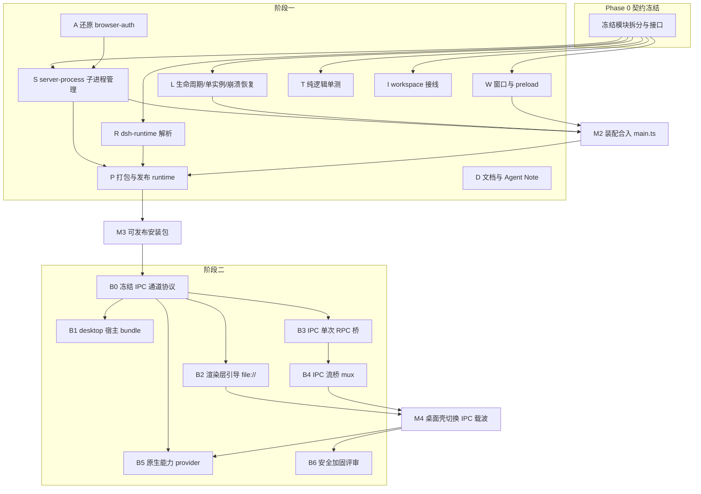

# DSH Desktop 桌面端计划（最大并行版）

目标：在遵守仓库 Application launch 规则（一切宿主经 `dsh` CLI + 命名 profile 启动，见 `docs/architecture.md#application-launch`）的前提下，分两阶段交付 Electron 桌面端。

- **阶段一（Web 壳）**：Electron 窗口加载 `dsh --profile web` 的已鉴权页面。改动全部收敛在 `apps/desktop/`（外加一处还原 `packages/client/connection/src/browser-auth.ts`），不新增 dsh 机制。
- **阶段二（IPC 载波）**：渲染层经 `file://` 加载 Web 前端 dist，RPC 经 Electron IPC 桥转发（`createWebConnectionRpc(doFetch, openStream)` 接缝，见 `packages/client/connection/src/client/rpc.ts:15-31`），原生能力以 provider 形态接入。阶段一全部合并后再启动。

## 并行策略

并行的前提是**轨道之间零文件重叠**。因此：

1. Phase 0 先冻结模块拆分与接口契约（半天内完成，阻塞所有后续轨道）。
2. 每条轨道独占一组文件（见文件归属表），主进程入口 `main.ts` 只做装配，由最后合入的轨道统一接线，避免多轨道改同一个文件。
3. 纯逻辑（stdout 解析、runtime 解析、kill 参数构造）与 Electron 依赖逻辑分离，前者可独立单测、先行开工。
4. 阶段二的并行前提是 B0 冻结 IPC 通道协议；B1–B6 在协议冻结后可全部并行。

## 依赖总图



关键路径：`F0 → S → M2 → P → M3`（阶段一），`B0 → B3 → B4 → M4`（阶段二）。A、R、L、W、T、I、D 均不在关键路径上，可与关键路径并行推进。

## Phase 0：契约冻结（阻塞项，≤0.5 天）

产出一份写入本文件的接口约定（下文"模块契约"），随后各轨道不得再改签名，只可追加。同时冻结文件归属：

| 轨道 | 独占文件 |
| --- | --- |
| S | `src/server-process.ts` |
| R | `src/dsh-runtime.ts` |
| L | `src/app-lifecycle.ts` |
| W | `src/main.ts`、`src/preload.ts`、`src/window/` |
| T | `src/**/*.test.ts`（限纯逻辑） |
| I | `package.json`、`tsconfig.json`、根 `pnpm-workspace.yaml` |
| P | `electron-builder.yml`、构建脚本 |
| D | `README.md`、`.agents/notes/` 草稿 |

### 模块契约（冻结稿）

```ts
// src/dsh-runtime.ts —— 轨道 R（已实现；rootDir 语义按模式细分）
export interface DshRuntime {
  command: string            // dev: node；packaged: 捆绑的 Node 运行时
  baseArgs: string[]         // dev: ['--import','tsx/esm',<repo>/apps/cli/src/bin.ts]；packaged: [<app 内 dsh bin>]
  cwd?: string               // dev: repo 根；packaged: 继承
  env: NodeJS.ProcessEnv     // 追加 DSH_* 环境变量
}
export function resolveDshRuntime(mode: 'dev' | 'packaged', rootDir: string, platform?: NodeJS.Platform): DshRuntime
// dev 的 rootDir = 仓库根；packaged 的 rootDir = 桌面 app 根（@deepseek-ai/dsh 是 app 自身依赖，
// 从 app 的 node_modules 解析——pnpm 严格隔离下仓库根解析域内没有该包）。

// src/server-process.ts —— 轨道 S（已实现）
/** 纯函数：从一行 stdout 解析 `dsh web: <url>`；不匹配返回 null。 */
export function parseLaunchLine(line: string): URL | null
/** 纯函数：构造跨平台进程树终止参数。win32 → taskkill /pid <pid> /T /F。 */
export function buildTreeKillArgs(pid: number, platform: NodeJS.Platform): { command: string; args: string[] } | null
export interface ServerHandle {
  /** 就绪即返回带 ?token= 的已鉴权 URL；超时/退出时 reject 并携带 stderr 尾部。 */
  waitForReady(timeoutMs: number): Promise<string>
  /** expected 标记该退出是否由 stop() 主动发起（区别于崩溃）。 */
  onExit(cb: (info: { code: number | null; expected: boolean }) => void): void
  /** 进程树终止，reap 后 resolve。 */
  stop(): Promise<void>
}
export function startServer(runtime: DshRuntime, opts: { port: number }): ServerHandle

// src/app-lifecycle.ts —— 轨道 L
export function acquireSingleInstance(): boolean
export function installExitHooks(handle: ServerHandle): void
export function watchForCrash(handle: ServerHandle, onDown: () => void): void
```

## 阶段一轨道明细

### A · 还原 browser-auth（先行，独立，~10 分钟）

- 还原 `packages/client/connection/src/browser-auth.ts` 的两处 DEV MODE `return true`（`authorizeIndex`、`isAuthenticated`），恢复上游实现。
- 验收：`git diff` 该文件为空；桌面端改用 token URL 后仍能正常加载（依赖 S 合入后端到端验证）。
- 无文件冲突，可立即单独成 PR。

### S · server-process 子进程管理（关键路径起点）

- `spawn` 无 shell 启动；参数 `['--profile','web','--no-open','--port', String(port)]`，`--port 0` 由 OS 分配，实际端口从就绪 URL 中取得。
- 用 `readline` 逐行读 stdout，`parseLaunchLine` 命中即 resolve `waitForReady`；注释依据：`packages/bundle/web-app/src/index.ts:280` 打印该行，且源码注释明示 supervisor 以此行为就绪信号。
- `stop()` 用 `buildTreeKillArgs` 终止整棵进程树（Windows 上 `exec`+`kill` 只杀 shell 会留孤儿占住端口，这是现状 bug）。
- 参考 `packages/experimental/webworker-runtime/src/worker-host.ts:240` 的同款 flags 用法。
- 验收：杀掉桌面进程后端口立即可复用；就绪耗时 = 实际启动耗时（无固定 sleep）。

### R · dsh-runtime 解析

- dev 模式：`node --import tsx/esm <repo>/apps/cli/src/bin.ts`，cwd 指向仓库根。
- packaged 模式：解析同版本 `dsh` 包的 bin（对齐 `packages/sdk/client` 的同版本解析方式）。
- **决策项（必须在此轨道内关闭）**：Electron 33 内嵌 Node ~20.18，低于 dsh 要求的 `^22.19 || >=24`。打包形态需捆绑独立 Node 运行时（electron-builder `extraResources`），不得用 `ELECTRON_RUN_AS_NODE`。决策结论写入本节。
- 验收：两种模式返回可执行的三元组；单测覆盖路径解析。

### L · 生命周期（与 S 并行，只依赖契约）

- `app.requestSingleInstanceLock()` 单实例；第二实例唤起已有窗口。
- `window-all-closed`/`before-quit`/`will-quit` 统一走 `installExitHooks`，保证 `stop()` 完成后才退出（macOS 激活重建窗口）。
- `watchForCrash`：子进程意外退出时通知 W 轨道渲染错误页，提供重启按钮。
- 验收：任务管理器中强杀 dsh 子进程，窗口出现可恢复的错误态；反复启停无残留进程。

### W · 窗口与 preload（可与 S/R/L 并行，用假 ServerHandle 开发）

- `main.ts` 装配：acquire → resolve runtime → startServer → `waitForReady` → `loadURL(authenticatedUrl)`。token→Cookie 交换由 Chromium Cookie jar 自动完成，无需手写。
- preload 维持最小面（`dsh-status`、后续加 `dsh-restart`）；`contextIsolation: true`、`nodeIntegration: false` 不变。
- 错误页：就绪超时/子进程崩溃时的落地页（本地 HTML，不依赖远端）。
- 验收：冷启动首屏即带 Cookie 的已登录态；无 5 秒白屏窗口期。

### T · 纯逻辑单测（契约冻结后即可全速并行）

- 覆盖 `parseLaunchLine`（含噪声行、多行、无 token 变体）、`buildTreeKillArgs`（win32/darwin/linux）、`resolveDshRuntime`（dev/packaged）。
- 遵守 CI 可靠性约束：不启动 Electron、不占端口、不起真实子进程（kill 参数与解析均为纯函数）。
- 验收：`apps/desktop` 内 `vitest`/`node --test` 全绿，可在仓库 CI 无头运行。

### I · workspace 接线

- 清理 `package.json` 中当前未使用的 `dsh-client-web/connection/modules/cordis` 依赖（阶段一用不到；阶段二 B2/B3 再按需引回）。
- 接入 `typecheck`/`lint` 脚本；确认根 workspace 对 `apps/*` 的处理方式（electron `allowBuilds` 已放行）。
- 验收：`pnpm run typecheck` 与 lint 覆盖到 `apps/desktop`，无未用依赖告警。

### P · 打包与发布 runtime（依赖 S+R 合入）

- `electron-builder` 配置：捆绑 Node 运行时 + `dsh` 包（版本锁定与本壳一致）、图标、安装器（nsis）；asar 处理需 unpack Node 运行时。
- `dsh` 以 npm 依赖形态随包分发，spawn 其 bin（同版本原则）。
- 验收：干净 Windows 机器上安装即用，不依赖全局 `dsh`、不依赖仓库源码与 tsx。

### D · 文档与 Agent Note

- 重写 `apps/desktop/README.md`：现状描述（"独立于 dsh 源码、仅包装 Web 界面"）与新架构不符，按 token 流、模块图、打包方式重写。
- 按仓库规范为非平凡变更写 Agent Note（阶段一 PR 内附）：动机（stdout 就绪行 + token 交换替代鉴权旁路）、决策记录（端口 0、进程树终止、捆绑 Node）。
- 验收：`pnpm run test:docs` 相关门禁通过。

## 阶段一并行编队建议（3–4 个工人）

| 工人 | 时序 |
| --- | --- |
| 1 | A → S → （M2 装配时与 W 合流） |
| 2 | R → P（含 Node 捆绑决策） |
| 3 | L ∥ W（用契约里的假 ServerHandle 并行开发） |
| 4 | T ∥ I ∥ D |

## 阶段二轨道明细（M3 后启动）

### B0 · 冻结 IPC 通道协议（阻塞 B1–B5，≤1 天）

```ts
// 单次 RPC（对应 doFetch）
'ipc:dsh/fetch'  request  { id, channel, endpoint, payload }
                 response { id, ok: true, value } | { id, ok: false, error }
// 事件流（对应 openStream，/api/remote.mux 的分帧转发）
'ipc:dsh/stream:open'   { streamId, path }
'ipc:dsh/stream:chunk'  { streamId, data: Uint8Array }   // 双向
'ipc:dsh/stream:close'  { streamId, reason? }
```

主进程侧持 token 完成 Cookie 交换，渲染层零网络。协议即阶段二的"契约冻结"，后续只追加不修改。

### B1 · desktop 宿主 bundle（仓库侧）

- 新建 `packages/bundle/desktop-app`：以 `web-app` 为底的 patch-layer bundle，禁用自动打开、锁定 127.0.0.1 回环、收紧 cookie 生命周期；仍经 `dsh --profile <name>` 启动（官方扩展点，见 `packages/bundle/README.md`）。
- 遵守 Application launch 规则：不新增可执行、不做进程内挂载。

### B2 · 渲染层引导（file:// 或 app:// 自定义协议）

- 桌面壳注入目前仅 dsh web 注入的 `window.__DSH_BOOT__`（参照 `packages/bundle/web-app/src/index.ts:144-155`）。
- 引入 client-web 的桌面入口构建（阶段一移除的 workspace 依赖在此按需引回）；资产经 `app://` 协议服务以获得正确 Origin 与 CSP（若 file:// 的 null Origin 引发问题则切换）。

### B3 · IPC 单次 RPC 桥

- preload 暴露 `dshFetch`，实现注入 `createWebConnectionRpc` 的 `doFetch` 接缝；主进程以 Cookie 转发到回环 `/api/<channel>/<endpoint>`。
- 与 B1 并行：B3 可先对着现有 `--profile web` 开发。

### B4 · IPC 流桥（依赖 B3）

- `openStream` 的 WebSocket mux（`/api/remote.mux`，见 `packages/api/gateway/src/stream-protocol.ts:6`）分帧转发：双向 chunk、背压、断线重连语义必须保真（`ConnectionController` 的重连逻辑依赖流语义）。

### B5 · 原生能力 provider

- 按 `2026-07-28-directory-picker-capability-seam` 的双面后端模式：原生目录选择（Electron dialog）、通知、托盘等，各为独立 provider，不动 gateway。

### B6 · 安全加固评审（M4 后集中一轮）

- IPC 通道白名单、进程/线边界处的 payload 校验（仓库规则：wire 边界必须校验）、CSP、`contextIsolation` 复核、token 不落渲染层。

## 里程碑与合流点

- **M2**（S+L+W 合入）：`main.ts` 一次性装配，端到端跑通 token 流。
- **M3**（P 合入）：可分发安装包，阶段一完结。
- **M4**（B2+B4 合入）：渲染层切换到 IPC 载波，localhost 仅存在于主进程↔dsh 之间。

## 验证与仓库纪律

- 每条轨道合入前跑：`apps/desktop` 局部 `typecheck` + 纯逻辑单测；涉及 `packages/` 的改动（A、B1）按 `dsh-pre-push-checks` 选最小集。
- 不引入 Electron 启动型测试进仓库 CI（无头不可靠）；端到端冒烟在本地 Windows 手动执行并记录。
- 阶段一、二各自的整体 PR 均附 Agent Note；A 轨道的还原 PR 单独提、先合。

## 风险清单

| 风险 | 影响 | 缓解 |
| --- | --- | --- |
| Electron 内嵌 Node 20.x 低于 dsh 最低版本 | 打包形态无法用 `ELECTRON_RUN_AS_NODE` | R 轨道捆绑独立 Node ^22.19+，P 轨道验证 |
| stdout 就绪行格式变更 | S 轨道解析失效 | 解析做成纯函数+单测钉住格式；与 web-app 打印逻辑同 PR 演进 |
| Windows 进程树终止不彻底 | 端口残留、僵尸进程 | `taskkill /T /F` + L 轨道验收项专测强杀场景 |
| 流桥丢帧/重连语义失真 | 会话事件丢失 | B4 以 `ConnectionController` 重连行为为准写契约测试 |
| `file://` null Origin 触发请求信任栅栏 | B2 阻塞 | 备选 `app://` 自定义协议，B0 阶段预判 |
